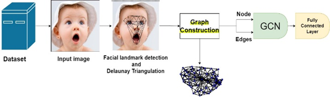

# EmotionRecognition_GCN
Emotion Recognition using Graph Convolutional Neural Network with Delaunay Landmark Features

Facial expression refers to the subcutaneous movements of facial muscles that convey an individual's emotional state to onlookers. The facial muscles movements involved in expression include those in the eyebrows, eyes, nose, and lips, among others. To utilizes of those to recognize people emotion based on the facial muscles, we propose a graph convolutional neural network that utilizes facial landmark to capture positional information of the facial muscles. The nodes in the graph were defined by the landmark and edges of the graph were built by using Delaunay triangulation method. By using it, we are able to capture structural information through facial landmarks that represent specific facial regions, such as the eyes, nose, lips, and eyebrows, using this method. The experimental results demonstrate that the proposed method classifies the seven fundamental emotions in the CK+ dataset with an accuracy of 95%.

#Overview of proposed method 

